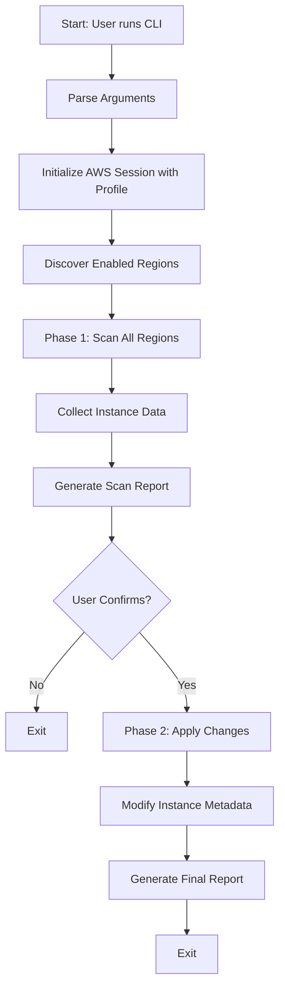
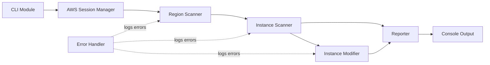
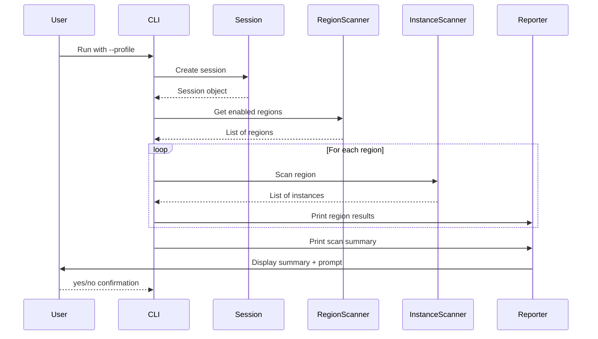
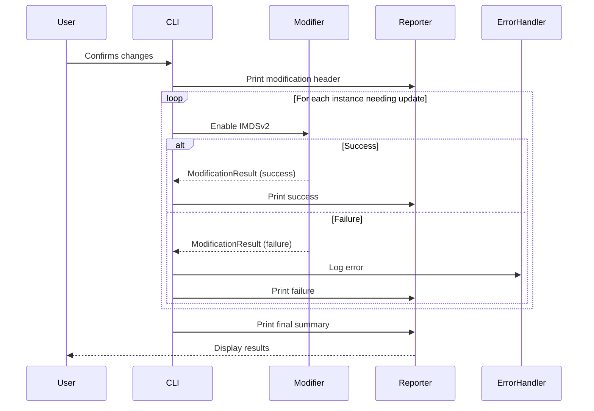

# EC2 IMDSv2 Enforcement Tool - Technical Plan

## Overview
This document provides the detailed technical design and implementation plan for the EC2 IMDSv2 enforcement tool.

## System Architecture

### High-Level Flow



### Component Architecture



## Detailed Component Specifications

### 1. CLI Module (`cli.py`)

**Responsibility**: Parse command-line arguments and orchestrate the workflow

**Arguments**:
- `--profile` (required): AWS profile name to use for authentication

**Implementation Details**:
```python
import argparse
import sys
from typing import Optional

def parse_arguments() -> argparse.Namespace:
    """Parse command line arguments"""
    parser = argparse.ArgumentParser(
        description='Enable IMDSv2 enforcement on EC2 instances across all regions',
        formatter_class=argparse.RawDescriptionHelpFormatter,
        epilog='''
Examples:
  %(prog)s --profile production
  %(prog)s --profile dev-account
        '''
    )
    
    parser.add_argument(
        '--profile',
        required=True,
        help='AWS profile name from ~/.aws/credentials or ~/.aws/config'
    )
    
    return parser.parse_args()

def main():
    """Main entry point"""
    args = parse_arguments()
    
    try:
        # Initialize session
        # Scan regions and instances (Phase 1)
        # Get user confirmation
        # Apply changes (Phase 2)
        # Display final report
        pass
    except KeyboardInterrupt:
        print("\nOperation cancelled by user")
        sys.exit(130)
    except Exception as e:
        print(f"Fatal error: {e}")
        sys.exit(1)
```

**Error Handling**:
- Invalid profile: Exit with error message
- Keyboard interrupt: Clean exit with appropriate message
- Unexpected errors: Log and exit

---

### 2. AWS Session Manager (`aws_session.py`)

**Responsibility**: Initialize and manage AWS session with specified profile

**Key Functions**:
```python
def create_session(profile_name: str) -> boto3.Session:
    """
    Create boto3 session with specified profile
    
    Args:
        profile_name: AWS profile name
        
    Returns:
        boto3.Session object
        
    Raises:
        ProfileNotFound: If profile doesn't exist
        NoCredentialsError: If credentials are not configured
    """
    pass

def get_account_id(session: boto3.Session) -> str:
    """
    Get AWS account ID for the session
    
    Args:
        session: boto3 Session object
        
    Returns:
        AWS account ID string
    """
    pass
```

**Implementation Details**:
- Use `boto3.Session(profile_name=profile_name)`
- Validate credentials by calling `sts.get_caller_identity()`
- Cache session for reuse across regions

**Error Handling**:
- `ProfileNotFound`: User-friendly error message with profile name
- `NoCredentialsError`: Guide user to configure AWS credentials
- Permission errors: Report which permissions are missing

---

### 3. Region Scanner (`region_scanner.py`)

**Responsibility**: Discover and enumerate all enabled AWS regions

**Key Functions**:
```python
def get_enabled_regions(session: boto3.Session) -> List[str]:
    """
    Get list of all enabled regions for the account
    
    Args:
        session: boto3 Session object
        
    Returns:
        List of region names (e.g., ['us-east-1', 'eu-west-1'])
        
    Note:
        Filters regions by OptInStatus to only include enabled regions
    """
    pass

def is_region_accessible(session: boto3.Session, region: str) -> bool:
    """
    Check if a region is accessible with current credentials
    
    Args:
        session: boto3 Session object
        region: Region name to check
        
    Returns:
        True if region is accessible, False otherwise
    """
    pass
```

**Implementation Details**:
- Use `ec2.describe_regions(AllRegions=False)` to get enabled regions
- Filter by `OptInStatus` in ['opt-in-not-required', 'opted-in']
- Sort regions alphabetically for consistent output

**Error Handling**:
- API failures: Log and return empty list
- Permission errors: Log specific region and continue

---

### 4. Instance Scanner (`instance_scanner.py`)

**Responsibility**: Discover EC2 instances and check their IMDSv2 status

**Data Structures**:
```python
from dataclasses import dataclass
from typing import Optional

@dataclass
class InstanceInfo:
    instance_id: str
    region: str
    state: str
    http_tokens: Optional[str]
    http_endpoint: Optional[str]
    needs_update: bool
    
    def __str__(self) -> str:
        status = "NOT enforced" if self.needs_update else "already enforced ✓"
        return f"Instance {self.instance_id} [{self.state}]: IMDSv2 {status}"
```

**Key Functions**:
```python
def scan_region(session: boto3.Session, region: str) -> List[InstanceInfo]:
    """
    Scan a region for EC2 instances and their IMDSv2 status
    
    Args:
        session: boto3 Session object
        region: Region name to scan
        
    Returns:
        List of InstanceInfo objects
    """
    pass

def check_imdsv2_status(instance_metadata: dict) -> tuple[str, bool]:
    """
    Check if instance requires IMDSv2 enforcement
    
    Args:
        instance_metadata: Instance metadata from describe_instances
        
    Returns:
        Tuple of (current_http_tokens_value, needs_update)
    """
    pass
```

**Implementation Details**:
- Use `ec2.describe_instances()` to get all instances
- Check `MetadataOptions.HttpTokens` field
- Instance needs update if `HttpTokens != 'required'`
- Include all instance states (running, stopped, terminated, etc.)

**Error Handling**:
- API failures: Log error with region, return empty list
- Malformed responses: Log warning, skip instance
- Rate limiting: Handled by boto3 retry mechanism

---

### 5. Instance Modifier (`instance_modifier.py`)

**Responsibility**: Apply IMDSv2 enforcement to instances

**Data Structures**:
```python
@dataclass
class ModificationResult:
    instance_id: str
    region: str
    success: bool
    state: Optional[str]  # 'applied' or 'pending'
    error_message: Optional[str]
```

**Key Functions**:
```python
def enable_imdsv2(
    session: boto3.Session,
    region: str,
    instance_id: str
) -> ModificationResult:
    """
    Enable IMDSv2 enforcement for a single instance
    
    Args:
        session: boto3 Session object
        region: Region name
        instance_id: Instance ID to modify
        
    Returns:
        ModificationResult object with operation status
    """
    pass

def batch_enable_imdsv2(
    session: boto3.Session,
    instances: List[InstanceInfo]
) -> List[ModificationResult]:
    """
    Enable IMDSv2 enforcement for multiple instances
    
    Args:
        session: boto3 Session object
        instances: List of InstanceInfo objects to modify
        
    Returns:
        List of ModificationResult objects
    """
    pass
```

**Implementation Details**:
- Use `ec2.modify_instance_metadata_options()`
- Set `HttpTokens='required'`
- Do not modify other metadata options
- Check response for state ('pending' or 'applied')

**Error Handling**:
- API failures: Capture error, set success=False, continue
- Permission errors: Log specific instance and error
- Invalid instance state errors: Log and continue

---

### 6. Reporter (`reporter.py`)

**Responsibility**: Format and display scan results and modification reports

**Key Functions**:
```python
def print_scan_header(profile: str, account_id: str):
    """Print scan phase header"""
    pass

def print_region_scan(region: str, instances: List[InstanceInfo]):
    """Print scan results for a region"""
    pass

def print_scan_summary(
    regions_count: int,
    total_instances: int,
    needs_update: int,
    already_compliant: int,
    errors: int
) -> bool:
    """
    Print scan summary and ask for confirmation
    
    Returns:
        True if user confirms, False otherwise
    """
    pass

def print_modification_header():
    """Print modification phase header"""
    pass

def print_modification_result(result: ModificationResult):
    """Print result of a single instance modification"""
    pass

def print_final_summary(
    successful: int,
    failed: int,
    elapsed_time: float,
    error_details: List[str]
):
    """Print final summary after all modifications"""
    pass
```

**Implementation Details**:
- Use ANSI color codes for better readability (optional)
- Format output with consistent indentation and alignment
- Use symbols (✓, ✗) for quick status identification
- Implement progress indicators for long-running operations

**Output Formatting**:
- Header separator: 80 equal signs
- Region header: Bold or colored
- Instance status: Indented with 2 spaces
- Summary sections: Separated by blank lines

---

### 7. Error Handler (`error_handler.py`)

**Responsibility**: Centralized error logging and tracking

**Data Structures**:
```python
@dataclass
class ErrorRecord:
    timestamp: datetime
    component: str
    region: Optional[str]
    instance_id: Optional[str]
    error_type: str
    error_message: str
```

**Key Functions**:
```python
class ErrorTracker:
    """Track errors across the application"""
    
    def __init__(self):
        self.errors: List[ErrorRecord] = []
    
    def log_error(
        self,
        component: str,
        error: Exception,
        region: Optional[str] = None,
        instance_id: Optional[str] = None
    ):
        """Log an error for later reporting"""
        pass
    
    def get_error_summary(self) -> List[str]:
        """Get formatted list of error messages"""
        pass
    
    def has_errors(self) -> bool:
        """Check if any errors were logged"""
        pass
```

**Implementation Details**:
- Singleton pattern for global error tracking
- Capture exception type, message, and context
- Provide formatted error summaries for reporting

---

## Data Flow

### Phase 1: Scan



### Phase 2: Apply



## API Usage Patterns

### DescribeRegions
```python
ec2_client = session.client('ec2')
response = ec2_client.describe_regions(
    AllRegions=False,  # Only enabled regions
    Filters=[
        {
            'Name': 'opt-in-status',
            'Values': ['opt-in-not-required', 'opted-in']
        }
    ]
)
regions = [r['RegionName'] for r in response['Regions']]
```

### DescribeInstances
```python
ec2_client = session.client('ec2', region_name=region)
paginator = ec2_client.get_paginator('describe_instances')
page_iterator = paginator.paginate()

for page in page_iterator:
    for reservation in page['Reservations']:
        for instance in reservation['Instances']:
            instance_id = instance['InstanceId']
            state = instance['State']['Name']
            metadata_opts = instance.get('MetadataOptions', {})
            http_tokens = metadata_opts.get('HttpTokens', 'optional')
            # Process instance...
```

### ModifyInstanceMetadataOptions
```python
ec2_client = session.client('ec2', region_name=region)
response = ec2_client.modify_instance_metadata_options(
    InstanceId=instance_id,
    HttpTokens='required'
)

# Check response
state = response['InstanceMetadataOptions']['State']
# state will be 'pending' or 'applied'
```

## Error Handling Strategy

### Error Categories

1. **Fatal Errors** (Stop execution):
   - Invalid AWS profile
   - No credentials configured
   - Missing required permissions for describe_regions

2. **Recoverable Errors** (Log and continue):
   - Region access denied
   - Instance modification failures
   - Network timeouts
   - Rate limiting (handled by boto3)

3. **Warning Conditions** (Log but don't treat as errors):
   - Instance already has IMDSv2 enabled
   - Empty regions (no instances)

### Error Messages

All error messages should include:
- Component/context where error occurred
- Region and instance ID (if applicable)
- Error type and message
- Suggested remediation (when possible)

Example:
```
✗ Failed to modify instance i-1234567890abcdef0 in us-west-2
  Error: InvalidInstanceID.NotFound
  Message: The instance ID 'i-1234567890abcdef0' does not exist
  Suggestion: The instance may have been terminated. Verify instance ID.
```

## Dependencies

### Required Python Packages
```
boto3>=1.34.0
botocore>=1.34.0
```

### Python Version
- Minimum: Python 3.8
- Recommended: Python 3.11+

## Testing Strategy

### Unit Tests
- Test each component in isolation
- Mock boto3 clients and responses
- Test error handling paths

### Integration Tests
- Test with mock AWS responses
- Verify correct API calls are made
- Test complete workflow end-to-end

### Manual Testing Scenarios
1. Account with no instances
2. Account with instances in multiple regions
3. Mix of instances with and without IMDSv2
4. Permission denied scenarios
5. Network failure scenarios
6. User cancellation at confirmation prompt

## Security Considerations

1. **No Credential Storage**:
   - Never store or log AWS credentials
   - Rely on AWS profile configuration

2. **No Sensitive Data in Logs**:
   - Don't log full API responses
   - Sanitize error messages

3. **Least Privilege**:
   - Document minimum required permissions
   - Tool should not require admin access

4. **Audit Trail**:
   - Log all modifications made
   - Include timestamps and user identity

## Performance Considerations

### Expected Performance
- Region enumeration: 1-2 seconds
- Scanning 100 instances in one region: 5-10 seconds
- Modifying 100 instances in one region: 20-30 seconds
- Total for 10 regions with 100 instances each: 3-5 minutes

### Optimization Opportunities (Future)
- Parallel region processing
- Batch API operations where supported
- Caching of region lists

## Future Enhancements

Potential features to add later:
1. `--dry-run` flag to skip confirmation
2. `--region` flag to limit to specific regions
3. `--filter` flag for tag-based filtering
4. `--output` flag for JSON/CSV reports
5. `--parallel` flag for concurrent region processing
6. Progress bars for long operations
7. Undo capability (revert to previous state)
8. Scheduling/automation support